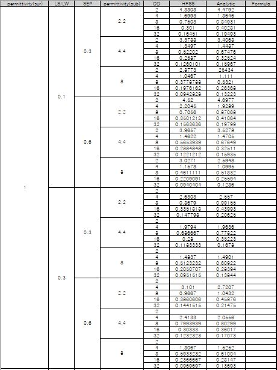
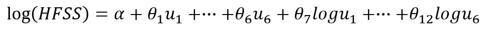
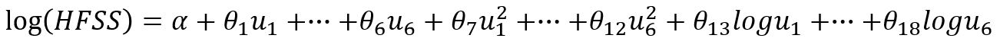

# HFSS-train

## Train 목적
주어진 table.xlsx의 데이터는 # of turns, permitivity(surface), LS/LW, SEP, permitivity(subsidence), OD, HFSS 로 이루어져있다.
이에 HFSS 이외의 6개의 feature로 HFSS를 표현하는 모델을 구축하고자 한다.

## Data preprocessing
주어진 table.xlsx의 데이터는 아래 그림과 같이 동일한 앞부분 feature에 대해 다른 뒤따라 오는 feature들이 표현되어 있는데, 이때 각각의 값으로 주어진 것이 아닌 큰 묶음 형식으로 표현되어 있다.


또한 필요한 데이터 이외에도 Analytic과 Fomula라는 column이 있어 이들을 제외하고 데이터를 생성해야 한다. 이에 따른 데이터 preprocessing 코드는 다음과 같다.

```python
import pandas as pd
import numpy as np

def data_restore(dat):
    for col_name in dat.columns[:5]:
        temp=0
        for i in range(len(dat[col_name])):
            if (dat.loc[i,col_name]!=0):
                temp=dat.loc[i,col_name]
            if (dat.loc[i,col_name]==0):
                dat.loc[i,col_name]=temp
    return dat

xls_data=pd.read_excel("./table.xlsx")
t2_dat=xls_data.loc[:,"# of turns":"HFSS"]
t3_dat=xls_data.loc[:,"# of turns.1":"HFSS.1"]
t4_dat=xls_data.loc[:,"# of turns.2":"HFSS.2"]
t2_dat=t2_dat.replace(np.nan,0)
t3_dat=t3_dat.replace(np.nan,0)
t4_dat=t4_dat.replace(np.nan,0)

t2_dat=data_restore(t2_dat)
t3_dat=data_restore(t3_dat)
t4_dat=data_restore(t4_dat)

del_index=np.where(total_dat_temp[:,6]==0)[0]
total_dat_temp=np.vstack([t2_dat.values,t3_dat.values,t4_dat.values])
total_dat_temp=pd.DataFrame(total_dat_temp,columns=t2_dat.columns)
total_dat=total_dat_temp.drop(del_index)

total_dat.to_csv("preprocessed_data.csv",
                 columns=total_dat.columns,sep=",", index=False)
```
## 구현할 regression model
여기서 HFSS를 추정하는 모델을 다음과 같이 설정하였다.
feature을 log만 사용한 경우.


feature을 log와 square을 사용한 경우.


## 결과
학습 결과는 다음과 같다. x축은 기존의 feature, y축은 target data(HFSS)이다.

### log, unnormalized, epoch 0.1m

### log, normalized, epoch 0.1m

### log, square, normalized, epoch 0.1m

### log, square, normalized, epoch 1m

