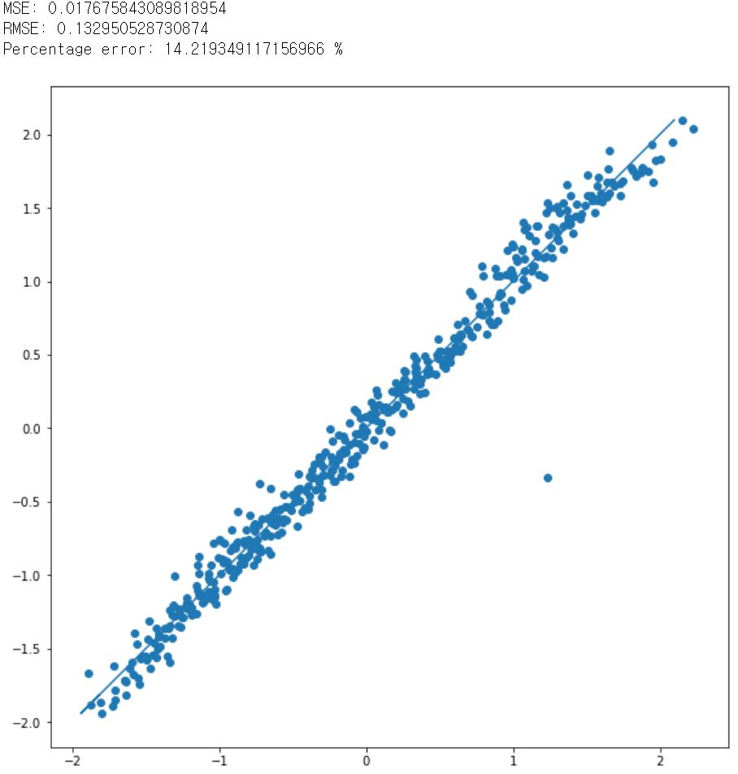
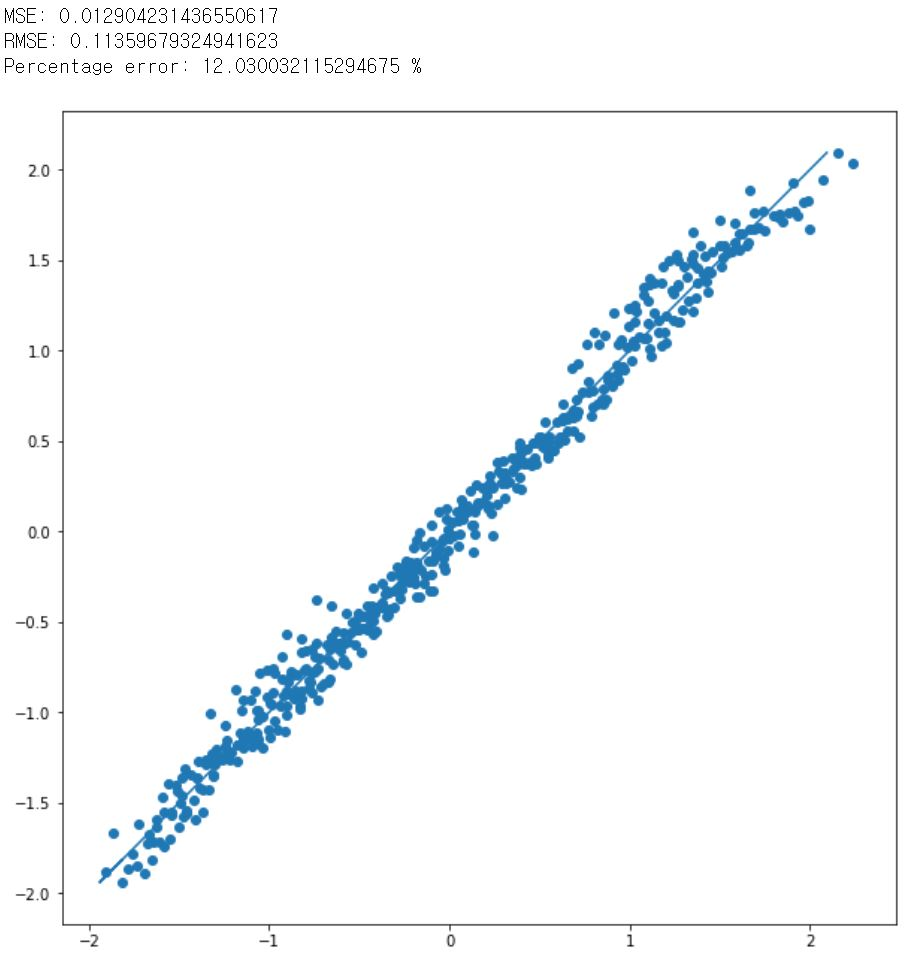

# HFSS-train

## Train 목적
주어진 table.xlsx의 데이터는 # of turns, permitivity(surface), LS/LW, SEP, permitivity(subsidence), OD, HFSS 로 이루어져있다.
이에 HFSS 이외의 6개의 feature로 HFSS를 표현하는 모델을 구축하고자 한다.

## 모델 구현
총 세가지 모델을 규정했으며, 각 모델은 다음을 가정한다.

### (log) model

### (log + first order) model

### (log + first order + second order) model

각 모델의 변수는 다음을 의미한다.

### Notation

## 구현 결과
각각의 모델에 대한 수렴 결과는 다음과 같다.
### (log) model result

### (log + first order) model result

### (log + first order + second order) model result

더 복잡한 구조의 모델이 Error rate가 감소함을 확인하였으나, 그 크기가 크지 않아, 이후 log만을 사용한 모델로 축소시켜 실험하였다.

## Outlier의 제거
여기서  한 점이 outlier로 발생하였다. 해당 값을 찾아보니 다음과 같았고, 이 값을 제외하고 다시 수렴시킨 결과 Error rate가 감소하였다.

### Value of outlier

### Result after reject outlier

## Normalize 방법 수정
이전까지는 normalize 방법을 standardize 방법을 채택했었는데, 이 방법은 변수 표본마다의 표준편차와 평균값이 달라질 수 있어 기존값을 복원하는데에 신뢰도가 떨어진다. 따라서 이를 대체하기 위해 단지 각 표본들을 Maximum 값으로 나누어 scaling을 진행하였다. scaling 후의 결과는 기존의 standardize보다 낮은 Error rate를 보였다.

