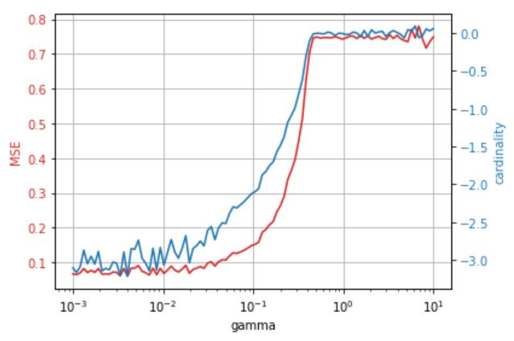
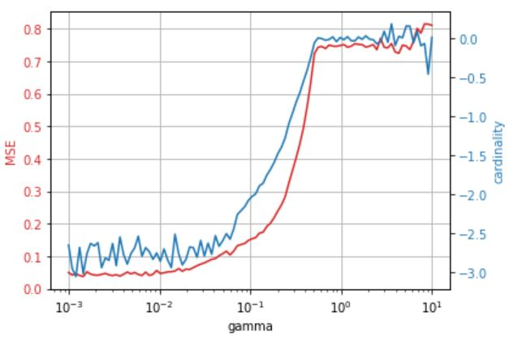
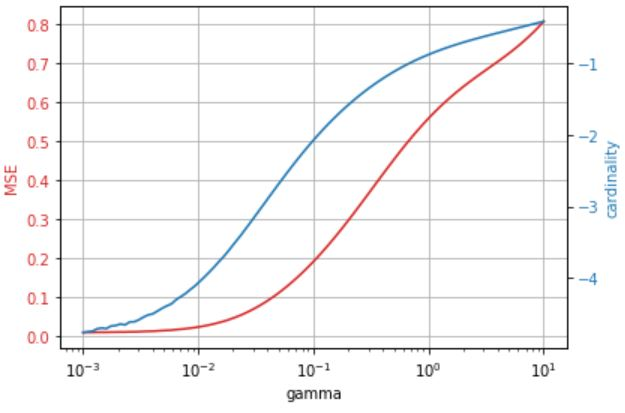
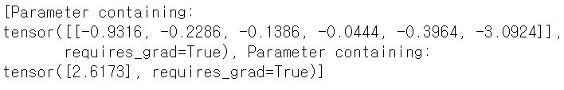

# HFSS-train

## Train 목적
주어진 table.xlsx의 데이터는 # of turns, permitivity(surface), LS/LW, SEP, permitivity(subsidence), OD, HFSS 로 이루어져있다.
이에 HFSS 이외의 6개의 feature로 HFSS를 표현하는 모델을 구축하고자 한다.

## 모델 구현
총 세가지 모델을 규정했으며, 각 모델은 다음을 가정한다.

### (log) model

### (log + first order) model

### (log + first order + second order) model

각 모델의 변수는 다음을 의미한다.

### Notation

여기서 우린 target value와 prediction value의 오차를 줄이기 위해 다음과 같은 Objective function을 최소화 해야 한다.
### Objective function

## 구현 결과
각각의 모델에 대한 수렴 결과는 다음과 같다.

### (log) model result

### (log + first order) model result

### (log + first order + second order) model result

더 복잡한 구조의 모델이 Error rate가 감소함을 확인하였으나, 그 크기가 크지 않아, 이후 log만을 사용한 모델로 축소시켜 실험하였다.

## Outlier의 제거
여기서  한 점이 outlier로 발생하였다. 해당 값을 찾아보니 다음과 같았고, 이 값을 제외하고 다시 수렴시킨 결과 Error rate가 감소하였다.

### Value of outlier

### Result after reject outlier

## Normalize 방법 수정
이전까지는 normalize 방법을 standardize 방법을 채택했었는데, 이 방법은 변수 표본마다의 표준편차와 평균값이 달라질 수 있어 기존값을 복원하는데에 신뢰도가 떨어진다. 따라서 이를 대체하기 위해 단지 각 표본들을 Maximum 값으로 나누어 scaling을 진행하였다. scaling 후의 결과는 기존의 standardize보다 낮은 Error rate를 보였다.

### Result after scaling input features

## Regularizer 추가
여기서 필요없는 feature을 제외하여 모델을 간소화 하고, overfit을 줄이기 위해 Regularizer을 추가하였다. Regularizer은 l1 norm을 사용하였다(Lasso regression).

### Objective function of Lasso regression

## 결과
pytorch를 사용한 결과로는 Regularizer를 적용시키기 어려웠다. 이는 아마 Gradient descent을 사용하는 수렴 방식에 의해 cardinality가 원하는 방향으로 진행되지 않는다고 판단하였다. 혹시 regularizer로 l2 norm을 사용하거나, first order feature을 추가시키면 결과가 달라질까 하여 실험해 보았는데, 여전히 원하는 결과가 도출되지 않았다. 따라서 Regularizer을 이용한 결과는 직접 gamma 값을 조정하며 수렴시켰고, 결과적으로 0.001 값을 주었을때 이상적으로 수렴함을 확인하였다.

### Cardinality for gamma (Lasso_GD)

### Cardinality for gamma (Lasso_GD with first order feature)

### Cardinality for gamma (Ridge_GD)

### Result after regularization(gamma = 0.001)

### Decision variables

